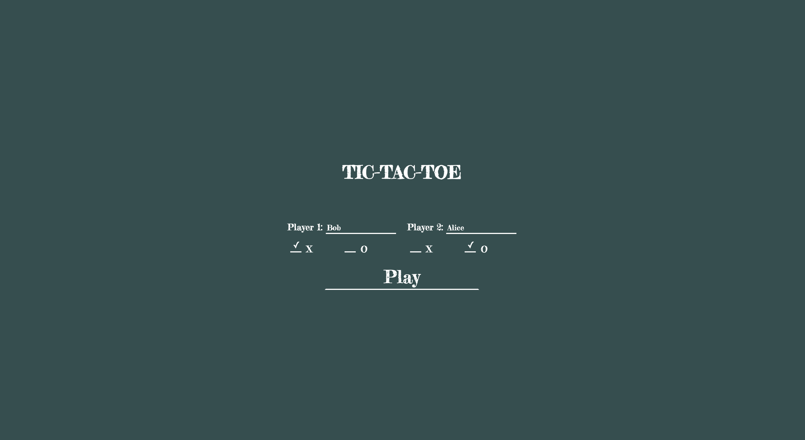
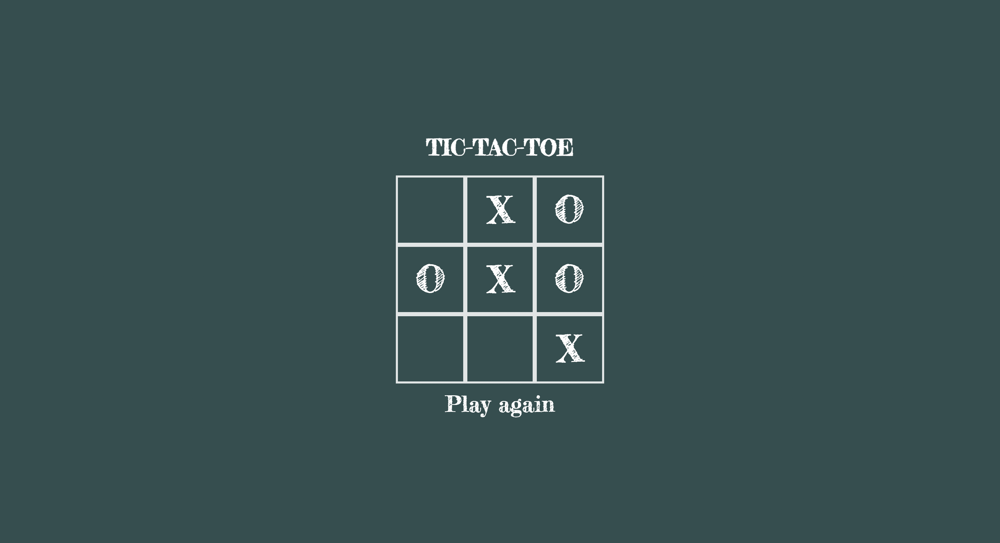

# Tic-tac-toe

Tic tac toe is a project from the [Javascript](https://www.theodinproject.com/paths/full-stack-javascript/courses/javascript) section of [The Odin Project](https://www.theodinproject.com). It is intended to give students the opportunity to familiarize themselves with basic object-oriented programming principles. Working demo [here](https://implexrr.github.io/tic-tac-toe/).




## Installation

To create a copy of the project, type the following command into your terminal:

```bash
git clone git@github.com:implexrr/tic-tac-toe.git
```

Note that the stylesheet and script link paths in this project will need to be changed in order for some of the CSS & JS files to render correctly.

## Usage/Features
[Take a look here!](https://implexrr.github.io/tic-tac-toe/). Not sure what tic-tac-toe is? Read the wikipedia article [here](https://en.wikipedia.org/wiki/Tic-tac-toe).


## Things I learnt creating the project
  - Object-oriented basics
  - Constructors
  - Object prototypes
  - Closure
  - Factory functions and the module pattern
  - IIFEs
  - Object inheritance
  - Private and public functions
  - Namespacing
  - ES6 modules


## Contributing

Pull requests are welcome. For major changes, please open an issue first
to discuss what you would like to change.

Please make sure to update tests as appropriate.

## License

[MIT](https://choosealicense.com/licenses/mit/)